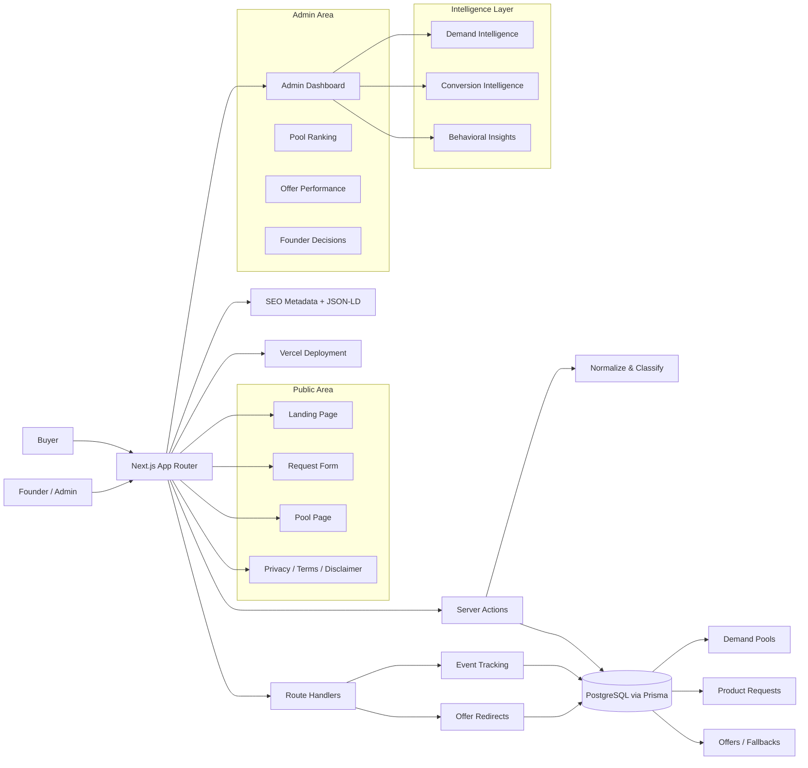
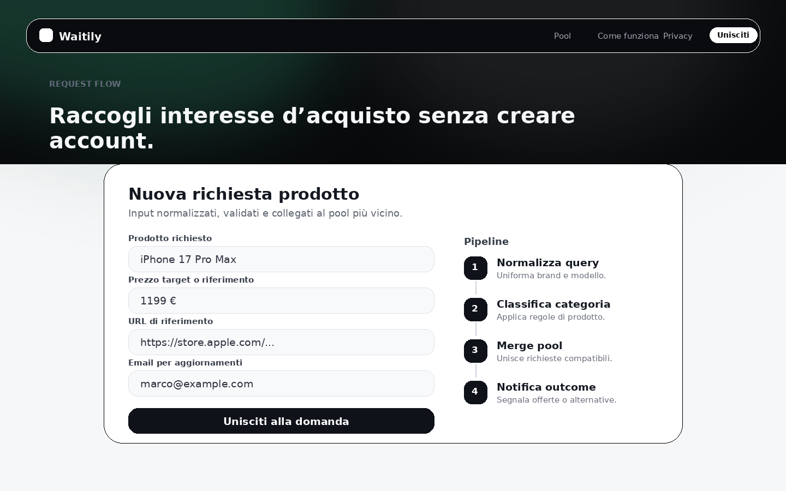
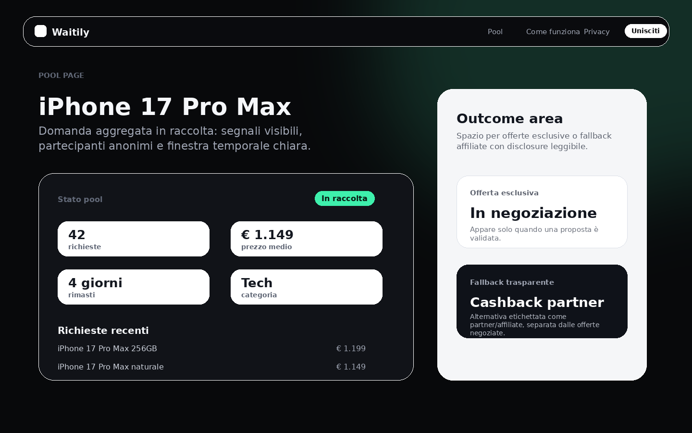
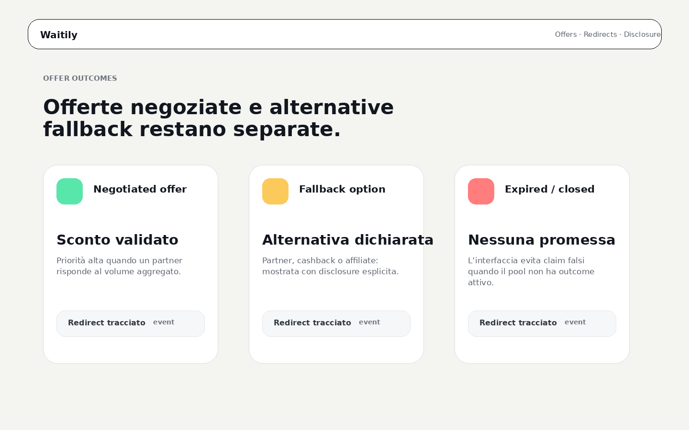
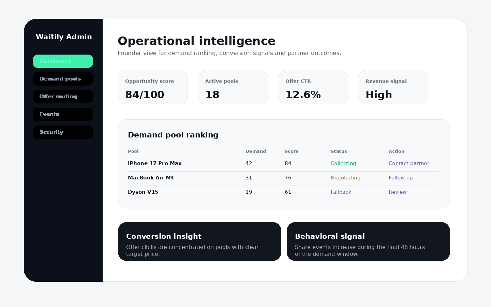

# Waitily

**Demand aggregation platform for purchase intent, negotiation signals and transparent offer outcomes.**

Waitily is a full-stack web application that lets people submit purchase requests, join similar demand pools and wait for better offers or useful fallback alternatives. The product turns fragmented buying intent into aggregated demand signals that can be evaluated, ranked and monetized without exposing individual users to retailers.

> This repository is a public showcase version created for portfolio and recruitment purposes.  
> The original production repository remains private. Sensitive business logic, environment variables, database credentials, Prisma schema details, user data and private infrastructure configuration are not included.

---

## Live Demo

🌐 **Website:** https://waitily.com

---

## Product Overview

Waitily helps users move from isolated price watching to structured purchase-intent aggregation.

The platform includes:

- a public landing page
- product request submission flow
- automatic query normalization
- category classification rules
- demand pool creation and merging
- pool-specific public pages
- demand window lifecycle
- user-facing pool status labels
- negotiated offer and fallback outcome areas
- affiliate/cashback disclosure handling
- share tracking for demand growth
- offer redirect tracking
- admin dashboard
- demand intelligence ranking
- conversion intelligence scoring
- behavioral event insights
- SEO metadata and JSON-LD for demand pool pages

---

## Tech Stack

### Frontend

- Next.js App Router
- React
- TypeScript
- Tailwind CSS

### Backend & Database

- Prisma
- PostgreSQL
- Supabase client
- Next.js Server Actions
- Next.js Route Handlers

### Deployment

- Vercel

---

## Key Features

### Demand Collection Flow

- Purchase request form
- Product query normalization
- Reference price capture
- Product/reference URL validation
- Email normalization and validation
- Automatic demand pool matching
- Seven-day default demand collection window
- No-account user participation flow

### Demand Pool Pages

- Public pool page by slug
- Demand count, category and average reference price
- Time remaining and lifecycle state
- Share action support
- Related requests list
- Exclusive offer section
- Fallback/affiliate/cashback alternatives
- Transparent partner disclosure copy
- SEO title, description and structured data generation

### Offer & Outcome Engine

- Offer type prioritization
- Active/expired offer checks
- Negotiated vs fallback distinction
- Offer ranking for users
- Estimated savings and cashback display
- Disclosure labels for partner/affiliate offers
- Offer click tracking and redirect handling

### Admin Intelligence Area

- Demand pool ranking
- Opportunity score calculation
- Category intelligence summary
- Growth and contact-density signals
- Founder decision labels
- Conversion performance scoring
- Offer click-through rate
- Monetization potential estimation
- Behavioral insights from pool views, offer clicks and shares

### Technical Features

- Server Actions for request creation
- Route Handlers for events and offer redirects
- Prisma data access layer
- Supabase client integration
- SEO metadata generation
- JSON-LD generation
- TypeScript utility modules
- Responsive dark UI
- Cloud deployment on Vercel

---

## Architecture Overview



---

## Route Structure

```text
app/
├── page.tsx                         # Public landing page and request form
├── pool/[slug]/                     # Public demand pool page
│   ├── page.tsx                     # Pool details, status, requests and offers
│   └── SharePoolButton.tsx          # Client-side share action
├── admin/                           # Founder/admin intelligence dashboard
│   └── page.tsx
├── events/route.ts                  # Share/event tracking route
├── offer/[id]/route.ts              # Offer click tracking and redirect route
├── privacy/page.tsx                 # Privacy page
├── terms/page.tsx                   # Terms page
├── disclaimer/page.tsx              # Commercial disclosure page
├── loading.tsx
├── not-found.tsx
└── actions.ts                       # Product request server action

lib/
├── classify.ts                      # Category rule matching
├── conversion-intelligence.ts       # Offer performance and monetization scoring
├── demand-intelligence.ts           # Pool ranking and strategic labels
├── demand-window.ts                 # Collection windows and status labels
├── events.ts                        # Behavioral event tracking helpers
├── normalize.ts                     # Query normalization
├── offer-intelligence.ts            # Offer ranking, labels and disclosures
├── prisma.ts                        # Prisma PostgreSQL client
├── seo.ts                           # Pool metadata, share text and JSON-LD
└── supabase.ts                      # Supabase client

scripts/
├── import-product-requests.ts       # Backfill/import utility
└── seed-category-rules.ts           # Category rule seed utility
```

---

## Screenshots

These visuals are **portfolio showcase previews reconstructed from the Waitily source structure and UI copy**. They are intentionally anonymized and do not contain production users, credentials or private operational data.

### Landing Page


### Request Form


### Demand Pool Page


### Offer Outcome Section


### Admin Intelligence Dashboard


---

## What I Built

I developed Waitily end-to-end, including:

- product concept and functional analysis
- public landing and request flow
- demand pooling logic
- query normalization
- category classification support
- demand window lifecycle
- pool page SEO and structured data
- user-facing status labels
- offer ranking and disclosure logic
- conversion intelligence helpers
- behavioral event tracking
- admin intelligence dashboard
- Prisma/PostgreSQL integration
- Supabase client integration
- responsive UI
- Vercel-ready Next.js architecture

---

## Code Samples

This repository includes simplified showcase components and helper examples inside `/components-demo`.

They are not the full production codebase, but they demonstrate:

- component structure
- reusable UI patterns
- clean TypeScript usage
- product-intelligence logic
- SaaS dashboard thinking
- demand-pool and offer-outcome modeling

---

## Repository Purpose

This public repository exists to show recruiters, founders and technical reviewers how Waitily was structured and what kind of product was built.

The full production application remains private for business and security reasons.
